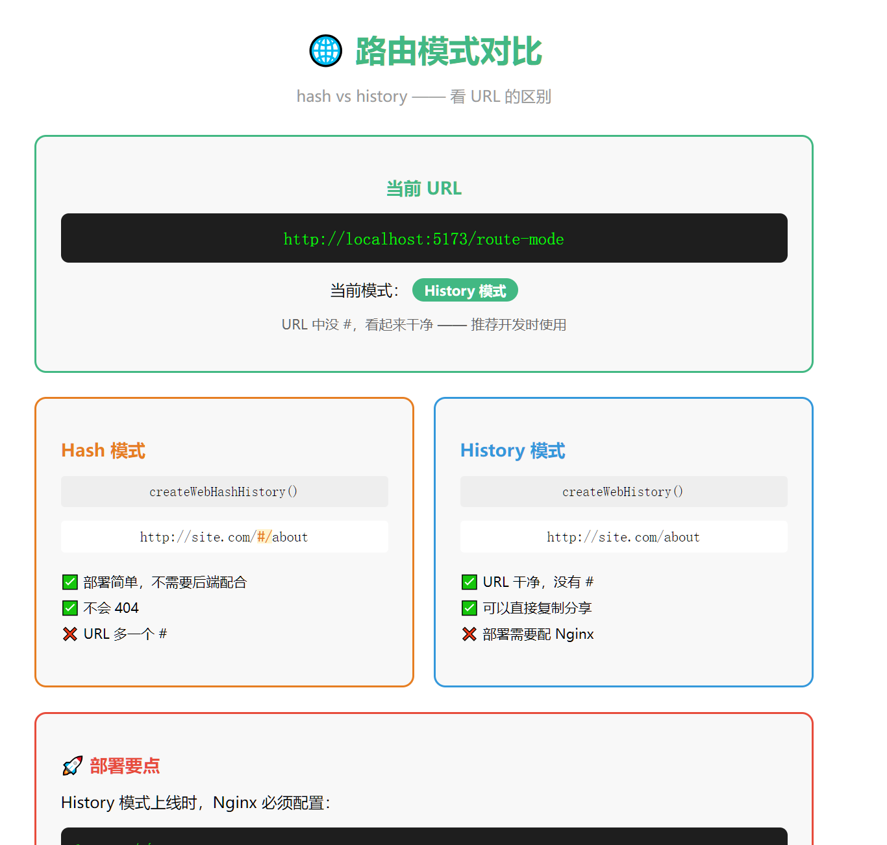
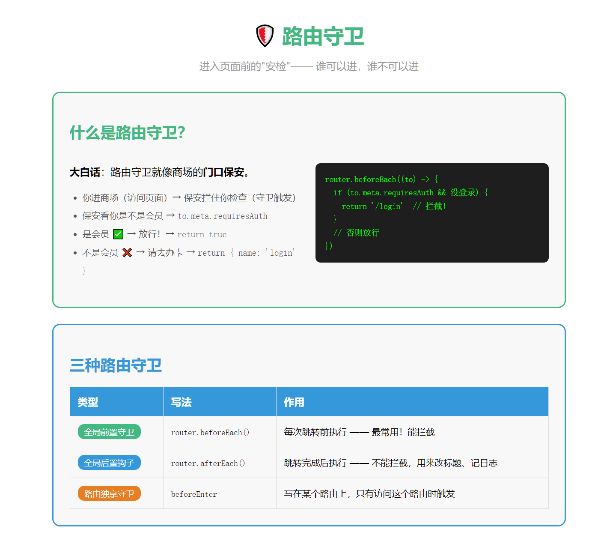
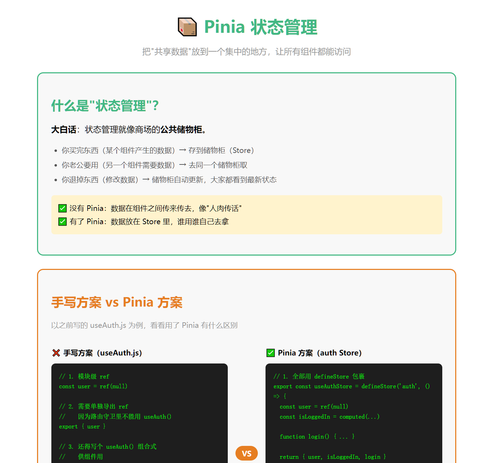
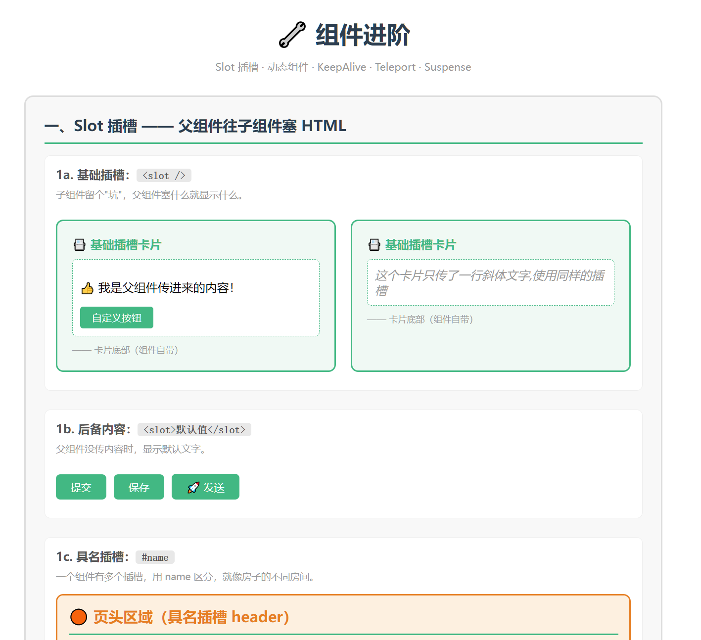

# Vue 3 零基础学习项目

一个从零开始的 Vue 3 学习项目，涵盖 7 个阶段的核心知识，每个阶段配有**详细的中文笔记**和**交互式演示页面**。

目标用户是零基础初学者，所有代码逐行注释，所有概念用大白话解释。

---

## 技术栈

| 技术                    | 用途                                    |
| ----------------------- | --------------------------------------- |
| **Vue 3** (`^3.5`)      | UI 框架（组合式 API + `<script setup>`) |
| **Vite** (`^6`)         | 构建工具与开发服务器                    |
| **Vue Router** (`^4`)   | 客户端路由                              |
| **Pinia** (`^3`)        | 状态管理                                |
| **Element Plus** (`^2`) | UI 组件库                               |
| **JavaScript**          | 全栈语言（无 TypeScript，降低入门门槛） |

---

## 项目图片






## 项目结构

```
vue3/
├── first-vue-app/              # 主项目目录
│   ├── src/
│   │   ├── pages/              # 页面级组件（路由页面）
│   │   │   ├── Home.vue                         # 首页
│   │   │   ├── About.vue                        # 关于页
│   │   │   ├── User.vue                         # 用户动态路由
│   │   │   ├── Product.vue                      # 商品动态路由
│   │   │   ├── Login.vue                        # 登录页（编程式导航演示）
│   │   │   ├── UserHome.vue                     # 用户中心首页（嵌套路由）
│   │   │   ├── UserProfile.vue                  # 用户资料页
│   │   │   ├── UserSettings.vue                 # 用户设置页
│   │   │   ├── UserOrders.vue                   # 用户订单页
│   │   │   ├── Dashboard.vue                    # 受保护页面
│   │   │   ├── RouteMode.vue                    # 路由模式演示
│   │   │   ├── GuardDemo.vue                    # 路由守卫演示
│   │   │   ├── NotFound.vue                     # 404 页面
│   │   │   ├── PiniaDemo.vue                    # Pinia 状态管理演示
│   │   │   ├── AdvComponentsDemo.vue            # 组件进阶演示
│   │   │   ├── TemplateSyntaxDemo.vue           # 模板语法演示
│   │   │   ├── ReactiveDataDemo.vue             # 响应式数据演示
│   │   │   └── ComponentBasicsDemo.vue          # 组件基础演示
│   │   ├── components/          # 可复用组件
│   │   │   ├── Child.vue                        # props/emits 子组件
│   │   │   ├── SlotChild.vue                    # slot 子组件
│   │   │   ├── Layout.vue                       # 容器组件示例
│   │   │   ├── MyBtn.vue                        # 自定义按钮
│   │   │   ├── MyCard.vue                       # 卡片组件
│   │   │   ├── MyItem.vue                       # v-for 列表项
│   │   │   ├── TodoItem.vue                     # Todo 项组件
│   │   │   └── adv/                             # 进阶演示组件
│   │   │       ├── SlotBasic.vue                # 基本插槽
│   │   │       ├── SlotNamed.vue                # 具名插槽
│   │   │       ├── SlotScoped.vue               # 作用域插槽
│   │   │       ├── MyBtnSlot.vue                # 按钮插槽封装
│   │   │       ├── TabA~TabD.vue                # 动态组件标签页
│   │   │       ├── TeleportModal.vue            # Teleport 弹窗
│   │   │       └── AsyncComp.vue                # Suspense 异步组件
│   │   ├── composables/        # 组合式函数
│   │   │   └── useAuth.js                       # 认证逻辑封装
│   │   ├── layouts/             # 布局组件
│   │   │   └── UserLayout.vue                   # 用户中心布局（嵌套路由）
│   │   ├── router/              # 路由配置
│   │   │   └── index.js                         # 全部路由规则 + 路由守卫
│   │   ├── stores/              # Pinia 状态管理
│   │   │   ├── counter.js                       # 计数器 Store
│   │   │   └── auth.js                          # 认证 Store
│   │   ├── App.vue              # 根组件（导航 + router-view）
│   │   └── main.js              # 应用入口
│   ├── index.html
│   ├── package.json
│   └── vite.config.js
├── 学习笔记/                   # 全部阶段的中文笔记（Markdown）
│   ├── vue3笔记-第一阶段-环境搭建.md
│   ├── vue3笔记-第二阶段-模板语法.md
│   ├── vue3笔记-第三阶段-响应式数据.md
│   ├── vue3笔记-第四阶段-组件化开发.md
│   ├── vue3笔记-第五阶段-VueRouter路由.md
│   ├── vue3笔记-第六阶段-Pinia状态管理.md
│   └── vue3笔记-第七阶段-组件进阶.md
├── 学习计划.md                 # 完整学习路线
├── CLAUDE.md                   # AI 辅助开发规范
└── README.md                   # 本文件
```

---

## 七阶段学习路线

每个阶段包含一篇详细的中文笔记 + 一个或多个可交互的演示页面。

### 第一阶段：环境搭建

- Node.js / npm 安装、Vite 创建项目、开发服务器启动
- 笔记涵盖 Vue 项目文件结构说明

### 第二阶段：模板语法

- **插值表达式** `{{ }}` — 在 HTML 中嵌入 JS 变量
- **v-text / v-html** — 文本与 HTML 渲染
- **v-bind**（简写 `:`）— 动态绑定 HTML 属性
- **v-on**（简写 `@`）— 事件绑定
- **v-model** — 双向数据绑定
- ▶️ 演示页：`/template-syntax`

### 第三阶段：响应式数据

- **ref** — 定义单个响应式数据
- **reactive** — 定义对象响应式数据
- **computed** — 计算属性
- **watch** — 侦听器
- **v-if / v-show** — 条件渲染
- **v-for** — 列表渲染
- ▶️ 演示页：`/reactive-data`

### 第四阶段：组件基础

- **defineProps** — 父传子
- **defineEmits** — 子传父
- **slot** — 插槽（内容分发）
- 容器组件 vs 展示组件
- ▶️ 演示页：`/component-basics`

### 第五阶段：Vue Router 路由

- **动态路由** `/user/:id`
- **嵌套路由** `/user-center/profile`
- **命名视图**（Header + Footer + 主体）
- **编程式导航** `router.push()`
- **路由模式**（history vs hash）
- **路由守卫**（`beforeEach`、`afterEach`、路由独享守卫）
- **404 页面**
- ▶️ 演示页：`/route-mode`、`/guard-demo`

### 第六阶段：Pinia 状态管理

- **Store 定义**（`defineStore` + 组合式写法）
- **state / getter / action**
- **多组件共享状态**
- **Pinia DevTools 调试**
- ▶️ 演示页：`/pinia-demo`

### 第七阶段：组件进阶

- **插槽进阶**（默认插槽、具名插槽、作用域插槽）
- **动态组件** `<component :is="">`
- **KeepAlive** 缓存组件状态
- **Teleport** 传送门（弹窗）
- **Suspense** 异步组件等待
- ▶️ 演示页：`/adv-components`

---

## 快速开始

```bash
# 1. 进入项目目录
cd first-vue-app

# 2. 安装依赖
npm install

# 3. 启动开发服务器（默认 http://localhost:5173）
npm run dev

# 4. 生产构建
npm run build

# 5. 本地预览生产构建
npm run preview
```

---

## 核心功能演示

### 路由系统

- 15+ 路由页面，涵盖动态路由、嵌套路由、命名视图
- 全局前置守卫（登录拦截）+ 路由独享守卫（角色权限）
- 全局后置钩子（页面标题、滚动复位、统计上报）

### 状态管理

- Pinia 组合式 Store（counter + auth）
- 跨页面/跨组件状态共享
- 路由守卫中直接读取 Store

### 组件通信

- `defineProps` / `defineEmits`（父子通信）
- 插槽（slot / 具名 slot / 作用域 slot）
- Provide / Inject（跨层级通信）

### 进阶特性

- 动态组件 + KeepAlive 缓存
- Teleport 弹窗
- Suspense 异步组件
- 自定义组合式函数（composables）

---

## 笔记风格

所有笔记位于 `学习笔记/` 目录，遵循统一格式：

```markdown
> **学习日期：** 2026-XX-XX
> **本阶段目标：** 一句话概括

### 大白话

用生活中的比喻解释概念。

### 完整代码（每行中文注释）

...

### 对比表格

| 概念A | 概念B |
| ----- | ----- |
| 特点  | 特点  |

### 你学到了什么？

| 知识点 | 是否掌握  |
| ------ | --------- |
| xxx    | □ 是 □ 否 |

### 思考题

1. ...
```

---

## 许可证

MIT 许可证

版权所有 (c) 2026 qq303812912
项目开源地址：https://gitee.com/qq303812918/vue3-study.git

特此免费授予任何获得本软件及相关文档文件副本的人，
不受限制地使用、复制、修改、合并、发布、分发、再授权和销售本软件，
同时允许向被提供本软件的人员授予同等权利，需遵守以下条件：

上述版权声明、本许可声明以及项目开源地址声明，
必须保留在本软件的所有副本或主要部分中。

本软件按原样提供，不提供任何明示或暗示的保证，
包括但不限于适销性、特定用途适用性和非侵权性保证。
在任何情况下，作者或版权持有人不对任何索赔、损害或其他责任负责，
无论是否因合同、侵权或其他行为产生，
与本软件的使用或其他相关行为无关。
